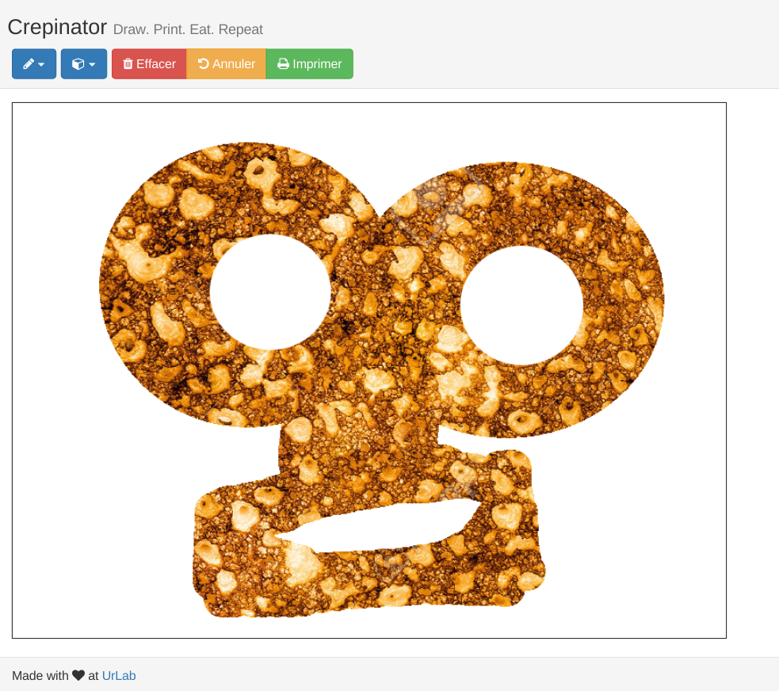
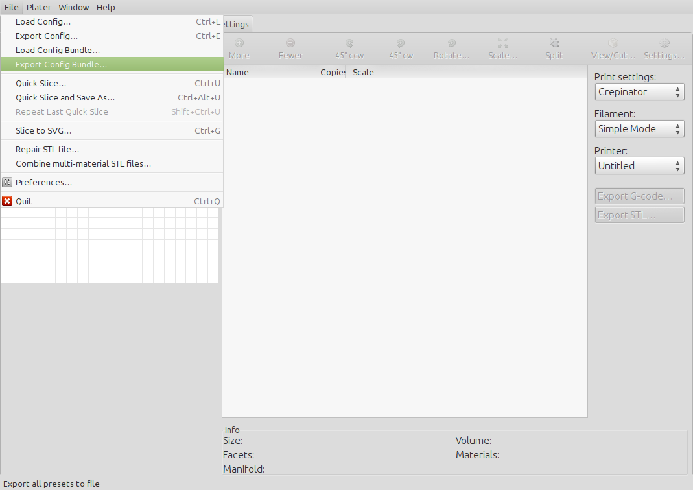

# Requirements

* python2, python3, virtualenv
* haml, sass
* node, npm

Example on Debian / Ubuntu:

    $ sudo apt-get install python-dev python-virtualenv python3 ruby nodejs libnacl-dev libffi-dev
    $ sudo gem install haml sass

# Install

`./install.sh`

# Run

`./run.sh`

# Tweak Slic3r config

In slic3r, go to `File > Export Config Bundle...`, and export a file to replace
[Slic3r_config_bundle.ini](Slic3r_config_bundle.ini). Then run `make slic3r.ini`
to generate the production configuration file.

